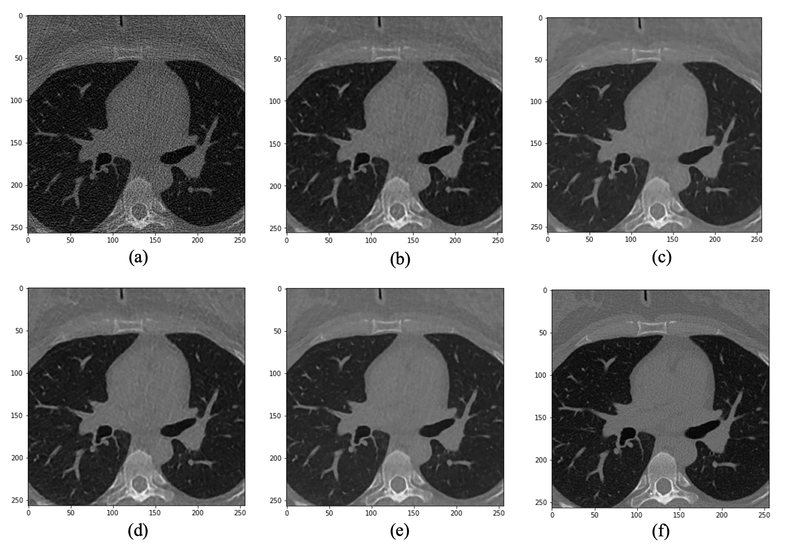
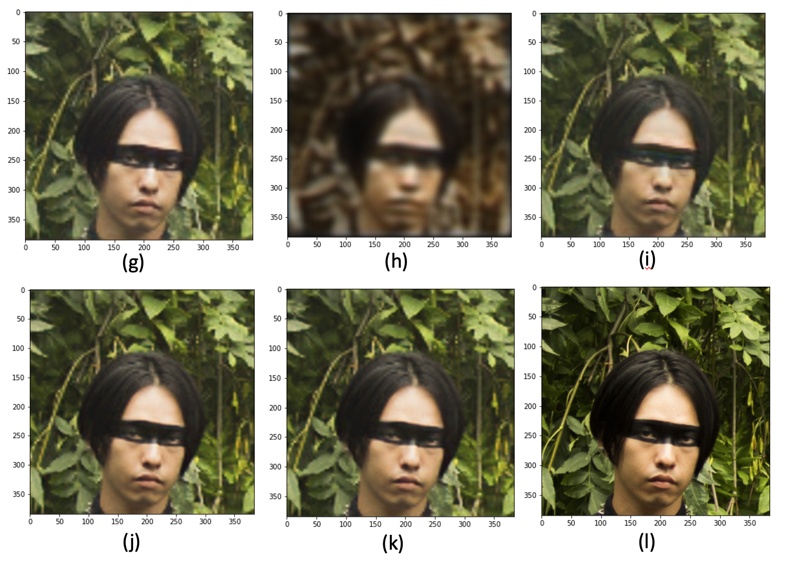

# Low-dose CT Image Denoising Using GANs

### Final Project for Duke University BME590D: Deep Learning Applications in Healthcare

By Sumin Lan and Baiying Lu

This code implements low-dose CT images denoising and reconstruction towards high-dose CT images using Generative Adversarial Network (GAN) based on Tensorflow 2.3 and Keras.

In this repository, we provide two directories "LDCT_codes" and "div2k_codes", and both of them include `.ipynb` files for different conditional GAN models:
1. Vanilla GAN
2. Wasserstein GAN (WGAN)
3. WGAN with gradient penalty

The "LDCT_codes" folders includes the methods and code related with our main goal: low-dose CT denoising. The result might be hard to tell by naked eyes. The "div2k_codes" folders includes the code which shows the effect from the GAN models.

### Results and Analysis

Here is the result from our LDCT conditional GANs:

In the upper figure, figure (a) is the low-dose CT image from the LDCT dataset. (b) is the image generated when adversarial weight equals zero, which means GAN doesn’t influence the result in (b), thus (b) could be a comparison figure to evaluate the effect from GANs. (c) is generated by Vanilla GAN. (d) is generated by WGAN. (e) is generated by WGAN-GP. (f) is the high-dose CT image.

| Comparison: High-dose  | Group  |  Low-dose | Vanilla GAN  | WGAN  | WGAN-GP  |
|---|---|---|---|---|---|
| PSNR  | train  | 18.10  | 23.72  | 25.41  | 26.25  |
| PSNR  | test  | 14.97  | 17.68  | 20.14  | 20.58  |
| SSIM  | train  | 0.58  | 0.84  | 0.84  | 0.845  |
| SSIM  | test  | 0.56  | 0.65  | 0.68  | 0.68  |

In this table, the PSNR and SSIM of the low-dose and high-dose CT images are calculated, shown in the "Low-dose" column in Table 1. From this table, the PSNRs and SSIMs from different models get improved remarkably compared with the value of these two metrics in the "Low-dose" column. In addition, from this table, the WGAN-GP model outperforms the Vanilla GAN and WGAN and produced the best PSNR and SSIM.

If we read the images by naked eyes, it might be hard to find the difference and the effect from the GANs. The reason might be from the dataset itself. So, if we show the results based on the "div2k" dataset:

In this figure, figure (a) is the low-resolution image from the div2k dataset. (b) is the image generated when adversarial weight equals zero. Based on the given code in "div2k_codes" folder, with the weight of g_loss is zero, the optimization result doesn't converge, so (b) is the result after 3 epochs. (c) is generated by Vanilla GAN. (d) is generated by WGAN. (e) is generated by WGAN-GP. (f) is the high-resolution image.

Licensed under the [MIT License](LICENSE.txt)
